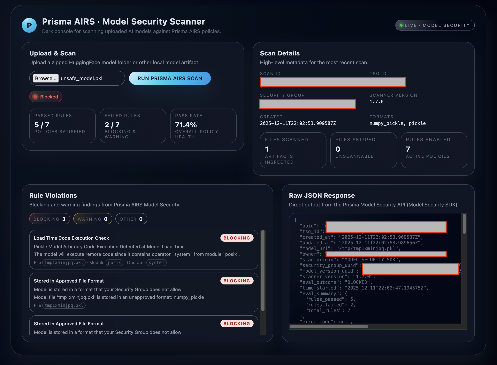
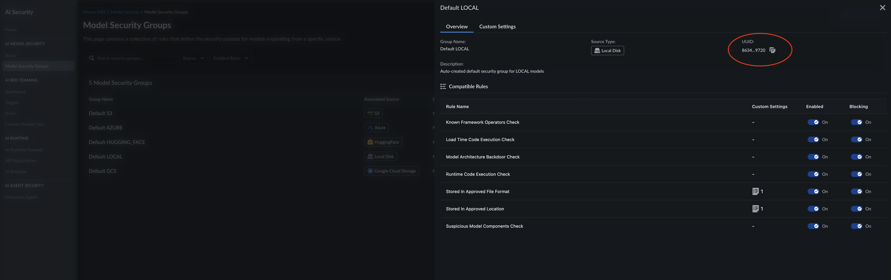

# 🛡️ AIRS Model Security Scanner

The following is a reference implementation for building a **web-based AI model security scanner** using **Prisma AIRS Model Security**, **FastAPI**, and **nginx**.

This project demonstrates how to:

- Upload a local or zipped AI model
- Scan it using the **Prisma AIRS Model Security SDK**
- Retrieve **detailed rule violations** via the AIRS Data API
- Present results in a simple web UI
- Serve the application behind **nginx**


---


---

## Prerequisites

- Prisma AIRS model scanning deployed in your SCM tenant ( Deployed via FlexCredits )
- Ubuntu 20.04+ server
- Python 3.10+
- `curl`, `jq`
- A **Prisma AIRS / Model Security service account**
  - `MODEL_SECURITY_CLIENT_ID`
  - `MODEL_SECURITY_CLIENT_SECRET`
  - `TSG_ID`

---

## 1️. System Setup

```bash
sudo apt update
sudo apt install -y \
  python3 \
  python3-venv \
  python3-pip \
  nginx \
  curl \
  jq
```

2. Create Folder and virtual env

```bash
mkdir ~/airs-model-security-scanner
cd ~/airs-model-security-scanner
python3 -m venv modelscan
source modelscan/bin/activate
```


3. Retrieve your Security Client ID/Client Secret and TSG from SCM.  Follow this guide for how to create a service account: https://pan.dev/scm/docs/service-accounts/

4. Set Environment Variables

The app reads credentials from environment variables:

```text

MODEL_SECURITY_CLIENT_ID

MODEL_SECURITY_CLIENT_SECRET

TSG_ID

LOCAL_SCAN_GROUP_UUID
```

To get your LOCAL_SCAN_GROUP_UUID simply log into SCM and view your model scanning groups



Set them in your shell:
```bash
export MODEL_SECURITY_CLIENT_ID="YOUR_SERVICE_ACCOUNT_CLIENT_ID"
export MODEL_SECURITY_CLIENT_SECRET="YOUR_SERVICE_ACCOUNT_CLIENT_SECRET"
export TSG_ID="YOUR_TSG_ID"
export LOCAL_SCAN_GROUP_UUID="your-security-group-uuid"

```

5. Create requirements.txt

In the project root, create requirements.txt:
```text
fastapi
uvicorn[standard]
python-multipart
requests
```
Install them:
```bash
pip install -r requirements.txt
```
6. We now need to pull down the private model scanning SDK.  This script will let us do that

```bash
nano get_pypi_url.sh
```
paste the following and save
```bash
#!/bin/bash
#
# Model Security Private PyPI Authentication Script
# Authenticates with Prisma AIRS and retrieves the PyPI repository URL
#

set -euo pipefail

: "${MODEL_SECURITY_CLIENT_ID:?Error: MODEL_SECURITY_CLIENT_ID not set}"
: "${MODEL_SECURITY_CLIENT_SECRET:?Error: MODEL_SECURITY_CLIENT_SECRET not set}"
: "${TSG_ID:?Error: TSG_ID not set}"

API_ENDPOINT="${MODEL_SECURITY_API_ENDPOINT:-https://api.sase.paloaltonetworks.com/aims}"
TOKEN_ENDPOINT="${MODEL_SECURITY_TOKEN_ENDPOINT:-https://auth.apps.paloaltonetworks.com/oauth2/access_token}"

# Get access token
TOKEN_RESPONSE=$(curl -sf -X POST "$TOKEN_ENDPOINT" \
  -H "Content-Type: application/x-www-form-urlencoded" \
  -u "$MODEL_SECURITY_CLIENT_ID:$MODEL_SECURITY_CLIENT_SECRET" \
  -d "grant_type=client_credentials&scope=tsg_id:$TSG_ID") || {
  echo "Error: Failed to obtain access token" >&2
  exit 1
}

SCM_TOKEN=$(echo "$TOKEN_RESPONSE" | jq -r '.access_token')
if [[ -z "$SCM_TOKEN" || "$SCM_TOKEN" == "null" ]]; then
  echo "Error: Failed to extract access token from response" >&2
  exit 1
fi

# Get PyPI URL
PYPI_RESPONSE=$(curl -sf -X GET "$API_ENDPOINT/mgmt/v1/pypi/authenticate" \
  -H "Authorization: Bearer $SCM_TOKEN") || {
  echo "Error: Failed to retrieve PyPI URL" >&2
  exit 1
}

PYPI_URL=$(echo "$PYPI_RESPONSE" | jq -r '.url')
if [[ -z "$PYPI_URL" || "$PYPI_URL" == "null" ]]; then
  echo "Error: Failed to extract PyPI URL from response" >&2
  exit 1
fi

echo "$PYPI_URL"
```
Make it executable
```bash
chmod +x get_pypi_url.sh
```

7. Install the Prisma AIRS Model Security SDK

Now pull and install the model-security-client package from the private PyPI:
```bash
PYPI_URL=$(./get_pypi_url.sh)
echo "Using private PyPI: $PYPI_URL"

pip install --extra-index-url "$PYPI_URL" model-security-client
```

If that completes without errors, your SDK is installed.

8.  Download/Copy Paste app.py from this repot and add it to your working folder  ( The folder you launched the venv from )

9.  Run the App with Uvicorn

   From the repo root, with venv active:
  ```bash
uvicorn app:app --host 0.0.0.0 --port 8000
```

Test the App

```text

If using IP only: http://YOUR_SERVER_IP:8000

If DNS points to server: http://modelscan.yourdomain.com:8000

Upload a zipped model (e.g. a small .bin or .pkl model) and you should see the results:


```

10.  Put nginx in Front (Public Exposure)

Create nginx-modelscan.conf modify your server_name to your DNS name or IP

```nginx
server {
    listen 80;
    server_name modelscan.yourdomain.com;

    location / {
        proxy_pass         http://127.0.0.1:8000;
        proxy_http_version 1.1;
        proxy_set_header   Host              $host;
        proxy_set_header   X-Real-IP         $remote_addr;
        proxy_set_header   X-Forwarded-For   $proxy_add_x_forwarded_for;
        proxy_set_header   X-Forwarded-Proto $scheme;
    }
}
```
Copy this into nginx and enable it:
```bash
sudo cp nginx-modelscan.conf /etc/nginx/sites-available/modelscan.conf
sudo ln -s /etc/nginx/sites-available/modelscan.conf /etc/nginx/sites-enabled/modelscan.conf

# Remove default site if you want
sudo rm /etc/nginx/sites-enabled/default 2>/dev/null || true

sudo nginx -t
sudo systemctl restart nginx
```

12.  You should be able to browser to your site on port 80.  You can now frontend it with CloudFlare to enable HTTPS or add certificates to your nginx and change the listen port to 443.

**SECURITY NOTES
```text
Tokens are short-lived

Secrets never exposed to browser

App intended to run behind reverse proxy

Network-level controls recommended
```


